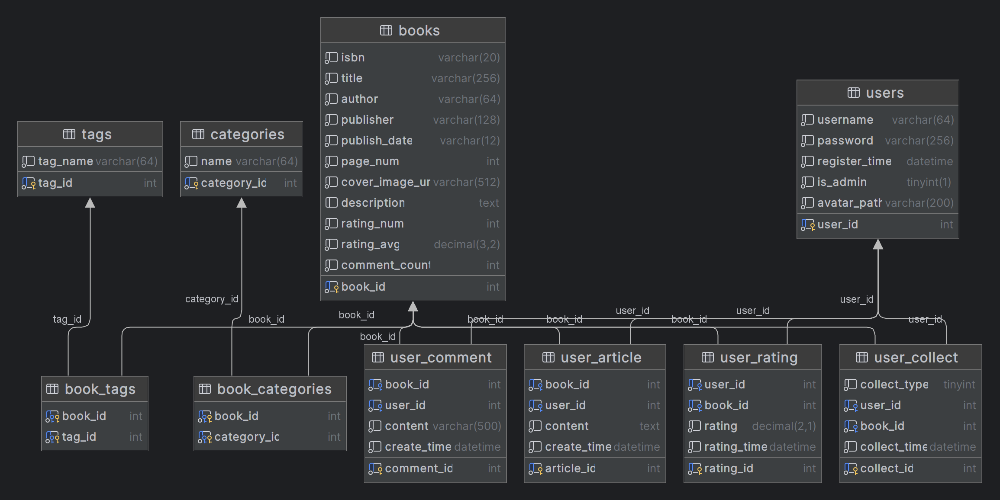

# BookRecommend_Back

**"一本好书"图书推荐系统的后端仓库**

## 运行说明
1. 根据book_recommend.sql建立数据库
2. 根据数据库配置config.py.example中的内容
3. 将config.py.example重命名为config.py
4. 依据requirements.txt安装依赖
5. 运行

## 前后端在同一局域网中通信
1. 关闭后端机公用网络防火墙
2. 后端机`ipconfig`,找到对应的IPv4 地址
3. 修改后端代码为`app.run(host='0.0.0.0', port=5000, debug=True)`
4. 注意pycharm的flask配置文件需在additional option一栏手动添加`--host=0.0.0.0 --port=5000`
5. 修改baseUrl

## 说明 
- 数据库结构图
  
- 前端仓库地址： [BookRecommend_Front](https://github.com/EuDs63/BookRecommend_Front)
- 书籍数据爬虫代码： [DoubanSpider](https://github.com/EuDs63/DoubanSpider)
- 部署记录： [“一本好书”部署记录 | EuDs's Blog](https://ds63.eu.org/2023/%E4%B8%80%E6%9C%AC%E5%A5%BD%E4%B9%A6%E9%83%A8%E7%BD%B2%E8%AE%B0%E5%BD%95/)

## 小组成员
- [EuDs63](https://github.com/EuDs63)
- [sun-yih](https://github.com/EuDs63)
- [SEUKURISU](https://github.com/SEUKURISU)
- [71121205](https://github.com/71121205)

## 技术参考
- [FLASK](https://flask.palletsprojects.com/en/2.3.x/quickstart/)
- [flask-sqlalchemy](https://flask-sqlalchemy.palletsprojects.com/en/3.0.x/)